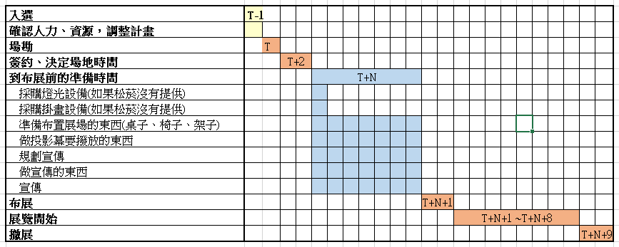
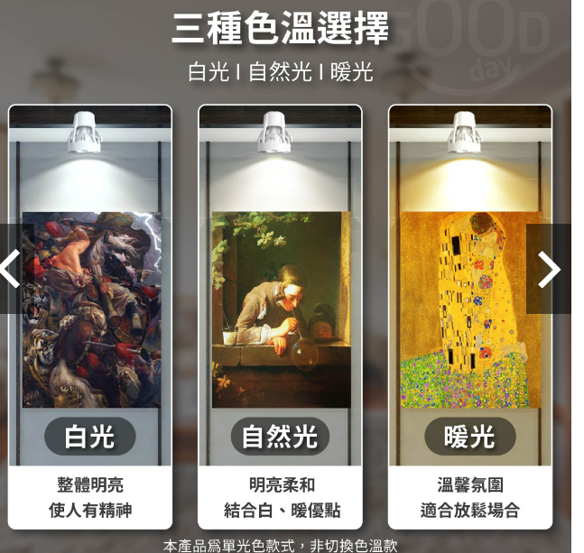
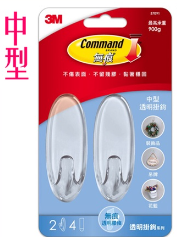
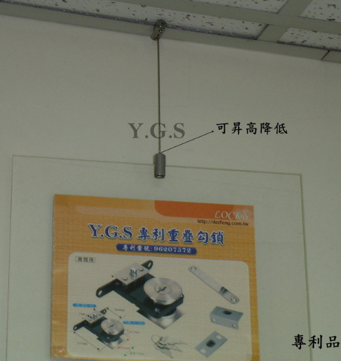
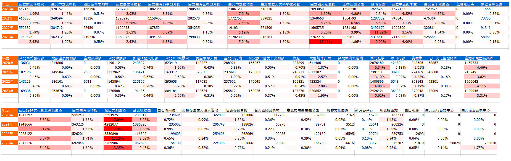

<h1 align="center">Leo的畫展</h1>

## 1. 目錄
 - 目錄
 - 活動說明
 - 宣傳方式
 - 問題評估與解決方案
 - 活動流程
 - 人力分配表
 - 時程進度規劃
 - 設備道具清單
 - 預算評估與分配
 - 預期效益
 - 備案
 - 附件

## 2. 活動說明
    為什麼要辦這個展 : 成為藝術家的人都會有在厲害的地方辦展覽跟賣作品的經歷，如果我有這樣的經歷，就可以從客觀角度成為藝術家，所以我希望透過這個展獲得在厲害的地方辦展跟賣作品的經歷

    活動內容 : 油畫作品展覽
    展覽時間 : 還沒確定
    目標客群 : 我的朋友、同事、客戶，我女兒幼稚園同學的爸爸媽媽、畫室老師同學、潛在買家、無聊想看展的人
    活動場地 : 松山文創園區
    活動進行方式 : 7.5天油畫展覽，2小時畫家導覽，1小時慈善拍賣會

## 3. 宣傳方式

紙本廣告
    
    到我常去美術行貼宣傳海報
    到我女兒幼稚園貼宣傳海報
    到有意願幫我貼海報的客戶公司貼宣傳海報

數位廣告(facebook、ig)...e.t.c.

## 4. 問題評估與解決方案
- 場地費用高 : 

        縮短展期，只展人多的時候
        找贊助

- 沒有適合場地檔期 : 

        延後展覽日期
        換場地

- 沒有人來看 : 

        做吸引人的宣傳廣告
        辦活動

- 對社對造成負面觀感 : 作品主要是景物、石膏像、卡通角色、幾何圖案，沒有亂七八糟的東西，沒有政治立場，應該是不會對社會有負面形象

- 有小偷會來偷東西 : 展覽期間要有人顧

## 5. 活動流程
    T-1日     : (22 - 08) 布展
    T日       : 開始展覽 (0800 - 2200)
    T+N(假日) : 作品導覽 (18:00) N待確認
    T+8       : 結束展覽 (0800 - 2200)、撤展 (2000 - 2200)、慶功宴 (2200-????)

## 6. 人力分配表
    3人 : 宣傳(規劃、製作、宣傳)、場地(場地租借、確認、場地布置、架設燈光)
    1人 : 掛畫、燈光調整
    3人 : 撤展(把布置現場的東西收起來(桌子椅子、燈光、電腦、畫))
    1人 (8天) : 顧展場、開門、關門、倒垃圾(如果有)

## 7. 時程進度規劃

入選後，確認人力、資源，到展覽場地確認展覽空間大小、時間，確認情況是否與規劃相符。
如果調整幅度太大，切換到場地備案。

決定場地、時間後，開始進行宣傳規劃，採購布置需要的東西，宣傳規劃準備好後，開始進行宣傳
到佈置會場當天，進行布置，然後等到開放時間就開始展覽

展覽期間，需要有一個人每天到展覽場地顧現場，因為怕有小偷還是奇怪的東西
展覽期間(SAT SUN MON TUE WED THU FRI SAT)
撤展當天舉辦慈善油畫拍賣會，選出最多人喜歡且還沒有被人買走的三幅作品在導覽後舉辦拍賣，拍賣金額捐給需要幫助的社會慈善團體

撤展，結束。

## 8. 設備道具清單
- 燈

- 掛畫的東西

        軌道鋼絲吊勾(方案1)
        3M掛勾(方案2)

- 宣傳廣告

- 給顧展覽的人坐的桌子椅子 (如果松山文創園區沒有)

- 擺電腦的桌子 (如果松山文創園區沒有)

- 電腦設備(撥放影片、投影片)

- 延長線(4.5m*3)

- 音箱(放音樂)

- MIC(作品導覽用)

- 垃圾袋

- 掃把 (如果松山文創園區沒有)

- 延長線

## 9. 預算評估與分配

|   項目   | 數量  | 價格  | 總價  |      備註      |
|------|---|---|---|------|
|   場地    | 1  | 8*3000+4000*2  | 32,000  |  展覽8天+進退場 |
|   燈光    | 10  |  219 |  2,190 |   |
|   延長線    | 3  |  548 |  1,644 | 66BN10045加大間距款4.5M  |
|   油畫裱框    | 10  |  800 |  8000 | 待確認  |
| 掛勾方案1  |  15 | 89  |  1,335 |   |
| 掛勾方案2  |  26 | 40  | 1,040  |   |
| 顧展場的人的便當/飲料  |  8 | 300  | 2,400  |   |
| 廣告  |  1 | 10,000  | 10,000  | 這個我真的沒概念  |
| 交通費  |  1 | 3,000  | 3,000  | 用在沒有車的人要前往展場交通費用  |
| petty cassh  |  1 | 5,000  | 5,000  | 用在預期以外的支出費用  |
| + )  |   |   | 66,609  |   |

## 10. 預期效益
我 : 得到曝光機會

公司 : 
       
        公司員工得到規劃、舉辦展覽經驗

        推廣藝術活動，協助社會弱勢，建立良好企業形象

        得到曝光機會

松山文創園區四年內，每一年都是台北市所有觀光景點人數最多的地方，曝光機會可觀

## 11. 備案
場地備案 : 衛星現代藝術博物館(展兩周，費用兩萬，有人幫忙顧)
掛畫的備案 : 方案一、方案二，取決於松菸場地有沒有提供滑軌

## 12. 附件

夾燈

https://shopee.tw/%E3%80%90Gooday%E2%9C%A8%E9%AB%98%E4%BA%AE%E5%8F%AF%E4%B8%B2%E6%8E%A5%E3%80%91%E6%93%BA%E6%94%A4%E5%A4%BE%E7%87%88-%E5%A4%BE%E5%BC%8F%E6%93%BA%E6%94%A4%E7%87%88-%E6%93%BA%E6%94%A4%E7%87%88-%E5%A4%BE%E5%AD%90-%E7%85%A7%E6%98%8E%E7%87%88-%E5%A4%9C%E5%B8%82%E7%87%88-%E5%B8%82%E9%9B%86%E7%87%88-LED%E7%87%88-%E9%AB%98%E4%BA%AE%E5%A4%BE%E7%87%88-%E5%B0%84%E7%87%88-%E6%8A%95%E5%B0%84%E7%87%88-i.8776550.19874218739?sp_atk=5bb2a9bf-486a-4cf4-b80b-0e51dcc8352a&xptdk=5bb2a9bf-486a-4cf4-b80b-0e51dcc8352a

3M 掛勾

https://shopee.tw/%E3%80%8A-978-%E8%B2%A9%E8%B3%A3%E6%A9%9F-%E3%80%8B-3M-%E7%84%A1%E7%97%95-%E9%80%8F%E6%98%8E-%E6%8E%9B%E9%89%A4-%E6%8E%9B%E9%88%8E-%E5%A4%A7%E5%9E%8B-%E4%B8%AD%E5%9E%8B-%E5%B0%8F%E5%9E%8B-%E8%BF%B7%E4%BD%A0-%E6%B4%BB%E5%8B%95-%E8%A3%9D%E9%A3%BE-%E5%9C%98%E8%B3%BC-%E6%89%B9%E7%99%BC-i.29059887.1303911198

掛畫鋼索

https://shopee.tw/CBX-%E5%90%8A%E5%9C%96%E9%8B%BC%E7%B4%A2-%E5%90%AB%E7%A8%85-%E4%B8%8D%E9%8F%BD%E9%8B%BC%E6%9D%90%E8%B3%AA-%E9%8B%BC%E7%B4%A2-%E5%90%8A%E5%9C%96%E9%8B%BC%E7%B4%A2-%E6%8E%9B%E5%9C%96%E5%99%A8-%E6%8E%9B%E7%95%AB%E9%89%A4-%E5%90%8A%E5%9C%96%E5%8B%BE-%E5%90%8A%E7%95%AB-%E6%8E%9B%E7%95%AB-%E9%8B%BC%E7%B4%A2-%E7%B9%A9%E7%B4%A2-%E6%BB%91%E8%BB%8C-%E8%BB%8C%E9%81%93-%E5%8F%B0%E7%81%A3%E8%A3%BD%E9%80%A0-i.284407880.18831207496?sp_atk=24783525-5895-4dc2-83eb-4b7b40c54358&xptdk=24783525-5895-4dc2-83eb-4b7b40c54358

延長線 

https://shopee.tw/%E3%80%90%E7%BE%A4%E5%8A%A0%E3%80%916%E9%96%8B6%E6%8F%92-%E6%9C%80%E6%96%B0%E5%AE%89%E8%A6%8F%E9%81%8E%E8%BC%89%E8%87%AA%E5%8B%95%E6%96%B7%E9%9B%BB%E5%BB%B6%E9%95%B7%E7%B7%9A-%E9%98%B2%E9%9B%B7%E6%93%8A%E6%8A%97%E6%90%96%E6%93%BA%E5%BB%B6%E9%95%B7%E7%B7%9A-TPS366AN-BN-%E8%BF%85%E7%9D%BF%E7%94%9F%E6%B4%BB-i.194401581.4364044237?sp_atk=b4bdfbec-c6d4-4f66-b2ea-72d2e2172e98&xptdk=b4bdfbec-c6d4-4f66-b2ea-72d2e2172e98

